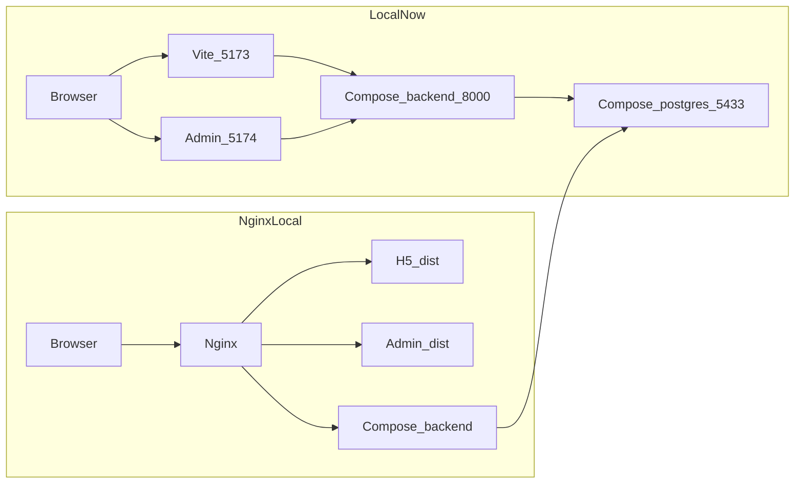
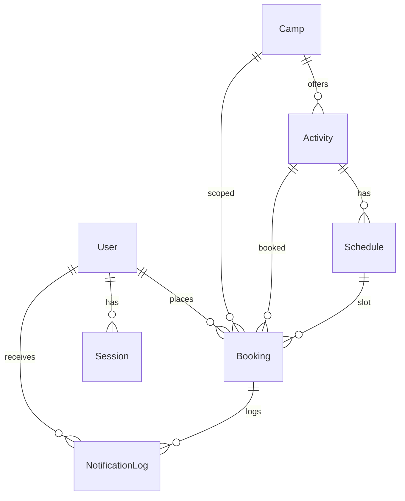

# 营地活动预约（activity-booking）

从营地公众号进入的轻量活动预约 H5。一套代码服务多个营地，最终部署到腾讯云 ECS。

## 技术栈

- 前端：Vue 3 + Vite + TypeScript + Vant 4（游客 H5）
- 员工后台：Vue 3 + Vite + TypeScript + Element Plus
- 后端：FastAPI（Python 3.12）
- 数据库：PostgreSQL 16
- 本地与生产编排：Docker Compose
- 生产：Ubuntu 24.04 + Nginx（静态资源 + 反向代理）+ HTTPS + 多营地域名

## 仓库结构

```text
activity-booking/                # 本地开发总入口
├── frontend/                    # 游客 H5（Vue 3 + Vite + TS + Vant）
│   ├── playground/              # Design System playground
│   └── src/
│       ├── assets/              # 静态资源
│       ├── data/                # mock 数据（营地介绍图集等 v1.1）
│       ├── components/          # 组件
│       ├── views/               # 页面视图
│       └── styles/              # Design tokens + Vant 主题 + reset
├── admin/                       # 员工后台（Vue 3 + Vite + TS + Element Plus）
├── backend/                     # 后端（FastAPI）
│   ├── app/
│   │   ├── main.py              # 创建 App、注册 router / middleware / exception / lifespan
│   │   ├── api/routers/         # HTTP：校验、调 Service、状态码
│   │   ├── schemas/             # Pydantic 入出参
│   │   ├── services/            # 业务编排
│   │   ├── repositories/        # 数据访问
│   │   ├── models/              # SQLAlchemy 表结构
│   │   ├── integrations/wechat/ # 微信 OAuth / 通知 Client
│   │   └── core/                # 配置、异常、中间件、引擎
│   ├── alembic/                 # 迁移脚本
│   ├── alembic.ini
│   ├── requirements.txt
│   ├── scripts/                 # 本地种子数据（不走 Alembic）
│   ├── Dockerfile               # FastAPI 镜像（第 17 步）
│   └── 后端/                    # Python 3.12 虚拟环境（不进 Git）
├── deploy/                      # Nginx 配置与前后端静态镜像（第 20 步）
│   ├── nginx/default.conf       # 本机预览 8080/8081
│   ├── nginx/prod.conf          # ECS：443 + 证书
│   └── web/Dockerfile
├── compose.yaml                 # 本机：postgres 5433 + backend 8000；`--profile web` 再起 Nginx
├── compose.prod.yaml            # ECS：只发布 80/443，不映射 5433/8000，不挂源码
├── backup/                      # 数据备份目录（第 23 步再加脚本；dump 文件不进 Git）
├── .env.example                 # 复制为 .env 后填写
└── README.md
```

`backup/` 目前是占位。`frontend/playground/` 是样式系统预览页，不进入游客主路径。虚拟环境目录 `backend/后端/` 不进 Git。第 17 步起 Postgres 与 FastAPI 由 Compose 启动；日常开发 H5 仍本机 Vite（5173），员工后台本机 Vite（5174），`/api` 都代理到 8000。本机预览生产形态用 `docker compose --profile web`（8080/8081，HTTP）。ECS 用 `docker compose -f compose.prod.yaml`（80/443，HTTPS）。

## 架构

本地可同时跑 Vite 开发服务器、FastAPI 与 PostgreSQL。Nginx 用 Compose profile，不替代日常 Vite。



生产目标（第 21–22 步）：把同一套 Compose（含 Nginx）放到腾讯云 ECS；域名 + HTTPS + 微信网页授权。多营地目前仍是路径前缀 `/{campSlug}`，不按营地域名拆 Cookie。

## 开发计划

Compose 与 PostgreSQL 前置到 Vue 之前，先稳住本地基础设施。

1. [x] 创建本地入口
2. [x] Docker Compose
3. [x] PostgreSQL 加入 Compose
4. [x] Vue 3 + Vite + TypeScript + Vant
5. [x] UI Design System
6. [x] Playground
7. [ ] 手机 / 微信预览
8. [x] 游客端页面（列表 + 详情 + 预约表单 + 我的预约 + 营地介绍）
9. [x] FastAPI 骨架（`/health` + Python 3.12 虚拟环境）
10. [x] 后端分层骨架（目录 + 本架构说明；无业务实现、无建表）
11. [x] SQLAlchemy Model + Alembic 首迁（禁止在 route 里 `CREATE TABLE`）
12. [x] 微信 `snsapi_base` + Session Cookie
13. [x] 营地 / 活动 / 排期只读 API
14. [x] 预约写入与排期库存
15. [x] 微信通知 Integration
16. [x] 前端去掉 localStorage，前后端联调
17. [x] Backend 加入 Compose
18. [x] 员工后台（登录 + 建联 + 改价/名额）
19. [x] 多营地 URL
20. [x] Nginx
21. [ ] 腾讯云 ECS
22. [ ] 生产 Compose 部署
23. [ ] 数据库自动备份

第 21 步进行中：2C4G Ubuntu 24.04 已 SSH；Docker CE + Compose 已装；`qucamp.cn` / `www` / `admin` A 记录已指到该机；ICP 备案已通过。仓库里已有 `compose.prod.yaml` 与 `deploy/nginx/prod.conf`。未完成：安全组放行 80/443（IPv4）、ECS 上放置证书与生产 `.env` 后启动该文件（第 22 步）。

**当前状态：** 第 1–6、8–20 步已完成；第 21 步进行中（如上）。游客端 H5 经 Vite 代理调 FastAPI：列表/价格/排期库存/下单/我的预约走 Postgres。营地用路径前缀区分：`/{campSlug}`、`/{campSlug}/activity/:id`、`/{campSlug}/camp`、`/{campSlug}/bookings` 等；`/` 与旧路径（`/activity/:id`、`/camp`、`/bookings`…）redirect 到 `/luhe/...`。未发布或未知 slug 为 H5 404。登录 `GET /api/auth/wechat/start?camp=`，callback 回到 `{H5_ORIGIN}/{slug}`；「我的预约」只列当前 URL 营地；模板跳转带 `/{slug}/bookings/{id}`。员工后台独立 `admin/`（5174）账号密码登录：按营地查看预约、建联、改待付款、取消预约，以及给已有活动加场次、改活动价格、改排期名额、关闭场次。改价不影响已下单金额；关场次不删除已有预约。H5 预约列表/详情在合计旁展示待付款（入库字段）；「付款前请联系工作人员」为前端固定文案，不进库。营地介绍的地点/故事/设施/套票与活动图集/标签/分段正文仍按活动名叠加前端 mock（v1.1，未拓表）。Postgres 与 FastAPI 由 Compose 启动（8000）；日常 H5 与后台仍本机 `npm run dev`（5173 / 5174）。可选 `docker compose --profile web` 用 Nginx 托管构建后的 H5（8080）与员工后台（8081）并反代 `/api`；8080 是 `dist` 快照，改源码不会自动更新。改表走 Alembic 迁移并重启 backend，不是重启 Postgres。ECS 用 `compose.prod.yaml`：Nginx 按域名听 443，证书挂载 `/opt/activity-booking/certs`，80 跳 HTTPS；Postgres 与 FastAPI 不映射到宿主机；uvicorn 不开启 `--reload`、不挂源码。微信真授权等 HTTPS 打开后再填服务器 `.env`。

**下一步：** 安全组对公网放行 80/443（来源 IPv4）。ECS `git clone` 后手写生产 `.env`（不要拷本机那份），证书放在 `/opt/activity-booking/certs/`。本机 `sh deploy/web/build-static.sh` 后，把 `frontend/dist` 与 `admin/dist` 放到服务器同样路径（或本机打好镜像再 `docker load`），再 `docker compose -f compose.prod.yaml up -d --build`。不要在 ECS 上 `npm run build`，不要把 5433/8000 映射到公网。日常开发仍是本机 `docker compose up` 与 Vite 5173/5174。

## 后端架构

禁止把数据库操作、业务逻辑、第三方 API 全部写进 FastAPI route 或 `main.py`。`main.py` 只负责：创建 App、注册 Router、注册 Middleware、注册 Exception Handler、生命周期初始化。

### 分层

| 层 | 路径 | 做 | 不做 |
| --- | --- | --- | --- |
| Router | `app/api/routers/` | HTTP、参数校验、调用 Service、返回 Response 与状态码 | SQL、库存事务、微信 HTTP |
| Schema | `app/schemas/` | Pydantic Request / Response / Query / Path | 查库 |
| Service | `app/services/` | 预约 / 用户 / 活动 / 排期 / 库存 / 状态机 / 登录编排 / 通知编排 | 直接调微信 HTTP、拼 SQL |
| Repository | `app/repositories/` | CRUD、条件检索 | HTTP、微信、业务规则 |
| Model | `app/models/` | SQLAlchemy 表结构 | 接口形状 |
| Integration | `app/integrations/wechat/` | 授权 URL、code → openid、模板通知 Client | 创建 User、写 Booking |
| Core | `app/core/` | 配置、异常、中间件挂载 | 业务 |

登录编排：`AuthRouter` → `AuthService` → `WechatOAuthClient` + `UserService` + `SessionService`。员工登录：`AdminAuthRouter` → `StaffAuthService`（账号密码 + `ab_admin_session`），不走微信、不复用游客 `User`。通知编排：`BookingService`（库存 `commit` 之后）→ `NotificationService` → `WechatNotifyClient`。`BookingService` 不 import 微信 Client。通知失败只打日志，不回滚预约。建联（`pending` → `contacted`）不发微信、不改库存。

数据库结构用 SQLAlchemy Model + Alembic Migration 管理。任何结构变化必须产生 migration。禁止在生产库手改表，也禁止在 route 里 `CREATE TABLE`。

### ER

游客端现状：营地介绍 + 活动列表/详情（日期 + 时段库存）+ 预约表单（姓名、成人/儿童、手机、备注、合计价）+ 状态 `pending | contacted | expired`。微信静默授权只证明身份；姓名和手机以**当次预约快照**为准。



与前端对照：

| 实体 | 建议字段 | 前端对照 |
| --- | --- | --- |
| User | `id`，`openid`（唯一、仅后端），`unionid`（可空），`name`/`phone`（资料、可空），时间戳 | 业务表只外键 `user_id`。`snsapi_base` 换票**不含 unionid**（官方文档：仅 `snsapi_userinfo` 返回） |
| Camp | `id`，`name`，`slug`，`description`，`status`，时间戳 | location / story / 设施 / 套票 / 须知标为 v1.1，不挡预约主链 |
| Activity | `id`，`camp_id`，`name`，`description`，`cover`，`duration`，`status`，以及 `price` / `child_price` / `notice` | 图集、标签、详情段落可后续拆表 |
| Schedule | `id`，`activity_id`，`start_time`，`end_time`，`capacity`，`booked_count`，`status` | 对应「某日 + 某时段」；库存以排期行为准 |
| Booking | `id`，`user_id`，`camp_id`，`activity_id`，`schedule_id`，`contact_name`，`contact_phone`（快照必填），`adult_count` / `child_count`，`remark`，`total_price`（下单快照），`unpaid_amount`（下单=合计，员工可改、不超过合计），`status`，时间戳 | 对齐表单；不要只留一个 `participant_count`；不要只依赖 User 的姓名手机 |
| NotificationLog | `id`，`user_id`，`booking_id`，`type`（`success` / `cancel` / `reminder`），`status`（`skipped` / `sent` / `failed`），`sent_at`（仅 `sent`），`error_message` | 已实现 |
| Session | `id`（随机 session id），`user_id`，`expires_at` | v1 存 PostgreSQL，不引入 Redis；Cookie 只带 session id |

套票 / 设施不进 v1 预约约束。

### 微信网页授权（snsapi_base）

依据 [微信网页授权](https://developers.weixin.qq.com/doc/service/guide/h5/auth.html)。适用**已认证服务号**。须配置网页授权域名（不含协议、全域名精确匹配）。`redirect_uri` 建议 https。授权链接参数顺序被强校验，必须以 `#wechat_redirect` 结尾。

第一版 `scope=snsapi_base`：静默、不弹窗、只能拿到 openid；此 scope 下换票后不必再调 userinfo。姓名/手机继续走预约表单快照。

```text
H5 → GET /api/auth/wechat/start
  → 302 open.weixin.qq.com/connect/oauth2/authorize
     (appid, redirect_uri, response_type=code, scope=snsapi_base, state, #wechat_redirect)
  → 微信回 redirect_uri/?code=&state=   （code 一次性，约 5 分钟）
  → GET /api/auth/wechat/callback
  → 校验 state（防 CSRF）
  → WechatOAuthClient：服务端 appid+secret+code
     GET api.weixin.qq.com/sns/oauth2/access_token
  → UserService 按 openid 查/建 User
  → SessionService 随机 session id，HttpOnly Cookie（生产 Secure）
  → 302 回 H5
```

安全：

- AppSecret、网页授权 access_token、服务号 access_token **只存在后端**，不进 Vue。
- OpenID 不当前端登录 Token，不进入业务 JSON。
- Session 使用随机不可预测的 Session ID，经 HttpOnly Cookie 下发。
- 必须校验 OAuth `state`。
- 若换票返回 `is_snapshotuser=1`（快照页虚拟号），拒绝当作正式用户。
- Secret 不进 Git。

**Mock 与真授权：** `WECHAT_APP_ID` 与 `WECHAT_APP_SECRET` **都非空** 时走真 `snsapi_base`；任一为空则走 mock（不请求微信）。Mock 下 `GET /api/auth/wechat/start?camp=` 会签发带营地 slug 的 `state` 并转到本服务 `/api/auth/wechat/callback?code=mock&state=...`，用固定 openid `mock-local-openid` 查/建 User、写 `sessions`、Set-Cookie 后 302 到 `{H5_ORIGIN}/{slug}`（`camp` 缺省 `luhe`；须为已发布营地否则 404）。补齐 `.env` 中的 AppID、AppSecret、`WECHAT_OAUTH_REDIRECT_URI`（及 `WECHAT_OAUTH_STATE_SECRET`）后无需改代码即可真授权。网页授权 access_token 不落库、不回传前端；`/api/auth/me` 只返回 `id` 与 `logged_in`，不含 openid。未登录时 `/me` 返回 `{ "id": null, "logged_in": false }`（200，不强制 401）。

### 微信模板通知

`NotificationService` 拼模板内容并写 `notification_logs`；`WechatNotifyClient` 只换 `client_credential` token（内存缓存）并 `POST cgi-bin/message/template/send`。openid 只在 Service/Client 使用，API JSON 仍不含 openid。

**Mock 与真发：** AppID、AppSecret、**且该事件对应模板 ID** 都非空才请求微信；任一为空则 mock（不 HTTP，日志 `status=skipped`）。真发还需要公众平台：模板消息权限、模板 ID、API IP 白名单、用户已关注服务号。本仓库代码不代替这些配置。

触发：

- 预约创建：`BookingService.create` 在库存 `commit` 成功之后发 `success`（HTTP 响应不等待微信成功）
- 取消：`cancel` 在 `expired` `commit` 成功之后发 `cancel`
- 提醒：不挂请求路径。`python scripts/send_reminders.py`（可 crontab）扫描 `pending` 且 `start_time` 在未来 24 小时内、尚未 `sent`/`skipped` reminder 的预约

模板 `data` 目前用通用 `keyword1`–`keyword4`（活动名、场次时间、人数、合计价），跳转 URL 为 `H5_ORIGIN/{camp.slug}/bookings/{id}`。**落地后须按公众平台实际字段名改映射。** `error_message` 截断不超过 1024 字。

### API 规划

Auth（已实现）：

- `GET /api/auth/wechat/start?camp=`（OAuth `state` 带 slug；缺省 `luhe`）
- `GET /api/auth/wechat/callback`（302 `{H5_ORIGIN}/{slug}`）
- `POST /api/auth/logout`
- `GET /api/auth/me`（user id / 是否登录，**不含 openid**）

目录只读（已实现，游客无需登录；未 seed 时营地 404）：

- `GET /api/camps/:slug` 营地介绍（仅 `published`）
- `GET /api/camps/:slug/activities` 列表（活动 `status` 由排期推导 `open` | `full`）
- `GET /api/activities/:id` 详情 + 排期库存（含 `remaining`、`camp_slug`）

预约（已实现，须有效 Session Cookie；未登录 401。合计价以后端为准；`adult_count + child_count` 占库存。开始前 24 小时内不可取消。创建/取消 `commit` 后写通知日志，失败不影响预约）：

- `POST /api/bookings` 创建（校验余位、写快照、占库存）
- `GET /api/bookings?camp=`、`GET /api/bookings/:id` 我的预约（列表可按营地过滤；响应含 `camp_slug`）
- `POST /api/bookings/:id/cancel` pending → expired（24 小时规则在 Service）

员工后台（已实现，须 `ab_admin_session`；游客 Cookie 无效。不走微信）：

- `POST /api/admin/login` 账号密码，Set-Cookie
- `POST /api/admin/logout`
- `GET /api/admin/me` 员工与绑定营地（不含密码）
- `GET /api/admin/bookings?status=` 当前营地预约列表
- `POST /api/admin/bookings/:id/contact` pending → contacted（不改库存、不发微信）
- `POST /api/admin/bookings/:id/unpaid` 改 `unpaid_amount`（pending/contacted；0～合计；不改 `total_price`、不改库存、不发微信）
- `POST /api/admin/bookings/:id/cancel` pending/contacted → expired（退库存、不卡 24 小时；`commit` 后发取消通知）
- `GET /api/admin/activities` 本营地活动 + 全部排期 + 每场未取消预约（含单笔金额与场次实收 `revenue`）
- `POST /api/admin/activities/:id` 改成人/儿童价（旧单 `total_price` 不变）
- `POST /api/admin/activities/:id/schedules` 给已有活动加场次（起止时间、总位数；可一并改该活动现价；新场默认开放）
- `POST /api/admin/schedules/:id` 改 `capacity`（不得小于已订）或 `status`（`open`/`closed`）

`/health` 无鉴权。业务 API 前缀 `/api`。本地 Vite 把 `/api` 代理到 `http://127.0.0.1:8000`。H5 Cookie 写在 `127.0.0.1:5173`，后台 Cookie 写在 `127.0.0.1:5174`，名称分别为 `ab_session` 与 `ab_admin_session`。Mock 游客登录须从 5173 打开 `/api/auth/wechat/start?camp=`，不要直接打 8000。

## 本地启动

### 依赖

- Docker Desktop（或兼容的 Docker Engine + Compose v2）
- Node.js 22+（前端开发服务器）
- Python 3.12（后端虚拟环境；本机默认 `python3` 若不是 3.12，请用 `python3.12`）

### PostgreSQL

```bash
cp .env.example .env
```

在 `.env` 中填写 `POSTGRES_PASSWORD`（必填，未填写则 Compose 会拒绝启动）。

```bash
docker compose up -d
docker compose ps
```

`postgres` 与 `backend` 均应为 running / healthy。Postgres 自检：

```bash
docker compose exec postgres pg_isready -U booking -d activity_booking
```

`pg_isready` 应输出 `accepting connections`。连接串（密码换成 `.env` 里的值）：

```text
postgresql://booking:<password>@127.0.0.1:5433/activity_booking
```

数据库名、用户、宿主机端口均可在 `.env` 中修改：`POSTGRES_DB`、`POSTGRES_USER`、`POSTGRES_HOST_PORT`。

若拉取 `postgres:16-alpine` 或 `python:3.12-slim` 超时，在 `.env` 中取消注释：

```bash
POSTGRES_IMAGE=docker.1ms.run/library/postgres:16-alpine
BACKEND_BASE_IMAGE=docker.1ms.run/library/python:3.12-slim
```

然后 `docker compose up -d --build`。

停止：`docker compose down`。数据在 named volume `postgres_data` 中，普通 `down` 不会删除。需要清空数据库时用 `docker compose down -v`（不可恢复）。

### 后端

日常用 Compose（容器启动时自动 `alembic upgrade head`）。**不要**再在本机占用 8000 的 uvicorn，否则与容器端口冲突。

```bash
docker compose up -d --build
curl -s http://127.0.0.1:8000/health
```

应返回 `{"status":"ok"}`。OpenAPI：`http://127.0.0.1:8000/docs`。容器内数据库地址是 `postgres:5432`，会覆盖 `.env` 里指向 `127.0.0.1:5433` 的 `DATABASE_URL`。本机 DBeaver / 本机脚本仍用 `127.0.0.1:5433`。

### Nginx（生产形态，本机预览）

日常开发仍用 Vite，不必开 Nginx。要验证「静态资源 + 反代 /api」（与上 ECS 同一套配置）时，先在本机构建前端（2 核云主机不适合现场 `npm run build`）：

```bash
sh deploy/web/build-static.sh
docker compose --profile web up -d --build
curl -s http://127.0.0.1:8080/health
curl -sI http://127.0.0.1:8080/luhe
```

浏览器打开 `http://127.0.0.1:8080/`（会进 `/luhe`）、员工后台 `http://127.0.0.1:8081/`。H5 与 `/api` 同域，Cookie 写在 8080。Playground：`http://127.0.0.1:8080/playground/`。

在 Nginx 入口测登录时，把 `.env` 的 `H5_ORIGIN` 改成 `http://127.0.0.1:8080`、`ADMIN_ORIGIN` 改成 `http://127.0.0.1:8081`，然后 `docker compose up -d --force-recreate backend`。改回 Vite 开发时再设回 5173/5174。本机预览不要用 `compose.prod.yaml`。

镜像在本机 `npm run build` 后打进 Nginx 镜像。2 核 4G 的 ECS 跑 postgres + backend + nginx 够用；不要在云主机上编译前端。ECS 启动：

```bash
docker compose -f compose.prod.yaml up -d --build
```

这会读取服务器上的 `.env`，把 `/opt/activity-booking/certs` 挂进 Nginx，并使用 `deploy/nginx/prod.conf`。`dist` 不在 Git 里，构建前要先放到服务器的 `frontend/dist` 与 `admin/dist`，或在本机 `docker build` 后 `docker save` / `docker load`。空库再执行下面的 `seed_catalog.py` 与 `seed_staff.py`。

只停 Nginx、保留数据库：

```bash
docker compose --profile web stop nginx
```

种子与提醒：

```bash
docker compose exec backend python scripts/seed_catalog.py
docker compose exec backend python scripts/seed_staff.py
docker compose exec backend python scripts/send_reminders.py
```

会写入已发布营地 `luhe`（麓禾村）、`qingxi`（清溪，1 个活动）和一条游客不可见的 `hidden-draft`。可重复执行。若该活动已有预约，seed **不会**删除排期，以免破坏库存。`seed_staff.py` 仍只绑 `luhe`。

`seed_staff.py` 按 `.env` 的 `ADMIN_USERNAME` / `ADMIN_PASSWORD` 写入绑定 `luhe` 的员工账号（密码哈希）。缺密码则退出。可重复执行（会更新密码）。无公开注册。

未填写微信 AppID/Secret 时，可用 mock 登录。H5 联调请从 **5173** 访问 `/api/auth/wechat/start?camp=luhe`（或当前营地 slug，经 Vite 代理），这样 Session Cookie 写在前端源。`GET /api/auth/me` 带 Cookie 应返回 `logged_in: true` 且 JSON 无 `openid`。

预约写入须登录。H5 在提交预约或打开「我的预约」遇到 401 时会跳到 mock 登录。未配模板 ID 时下单/取消仍成功，并在 `notification_logs` 写入 `skipped`。日常开发前端不进 Compose；` --profile web` 时 Nginx 镜像内含 H5 与员工后台的构建产物。

本机虚拟环境仅在不经过 Docker 调试时需要：

```bash
cd backend
python3.12 -m venv 后端
source 后端/bin/activate
pip install -r requirements.txt
```

结构变化必须再生成 migration（`alembic revision --autogenerate -m "..."`），禁止在 route 或 `main.py` 里 `CREATE TABLE` / `create_all`。

### 前端

须先 `docker compose up -d`（Postgres + FastAPI:8000），再开 Vite；开发服务器把 `/api` 代理到后端。

```bash
cd frontend
npm install
npm run dev
```

浏览器打开终端里打印的地址（默认 `http://127.0.0.1:5173`，会进 `/luhe`）。Vite 已开启 `host: true`，同一局域网的手机也可访问打印出的 Network 地址。游客 URL：`/{campSlug}` 首页、`/{campSlug}/activity/:id`、`/{campSlug}/camp`、`/{campSlug}/bookings`；Playground 仍是 `/playground/`。对比第二座营地用 `/qingxi`。首页与活动详情的价格/排期余位来自 Postgres；「立即预约」走 `POST /api/bookings`（未登录会跳转 `/api/auth/wechat/start?camp=`）。营地介绍的地点/故事/设施/套票，以及活动轮播、标签、分段正文仍是前端 mock（按活动名叠加）。

样式系统 Playground：`http://127.0.0.1:5173/playground/`（色板、字体、间距、圆角、Vant 示例）。

`4173` 是 `npm run preview` 的生产构建预览端口，不是开发服务。日常请用 `npm run dev`（5173）。

生产构建：

```bash
cd frontend
npm run build
```

### 员工后台

后台日常不进 Compose；`docker compose --profile web` 时由 Nginx 在 8081 提供构建后的后台。

```bash
cd admin
npm install
npm run dev
```

打开 `http://127.0.0.1:5174`。用 `ADMIN_USERNAME` / `ADMIN_PASSWORD` 登录。401 跳 `/login`，不走微信。可看本营地预约（场次 + 下单时间）、建联、改待付款、取消预约；「活动排期」里给已有活动加场次、改价、改名额、关闭/重开场次。不做新建活动与图集。`.env` 里密码若含 `#` 请加引号，改完 `.env` 后需 `docker compose up -d --force-recreate backend` 再 `seed_staff.py`。

生产构建：

```bash
cd admin
npm run build
```

## 环境变量

| 变量 | 说明 | 默认 |
| --- | --- | --- |
| `POSTGRES_DB` | 数据库名 | `activity_booking` |
| `POSTGRES_USER` | 用户名 | `booking` |
| `POSTGRES_PASSWORD` | 密码（必填） | 无 |
| `POSTGRES_HOST_PORT` | 宿主机 Postgres 端口 | `5433` |
| `BACKEND_HOST_PORT` | 宿主机 FastAPI 端口 | `8000` |
| `TZ` | 时区 | `Asia/Shanghai` |
| `POSTGRES_IMAGE` | Postgres 镜像（可选换源） | `postgres:16-alpine` |
| `BACKEND_BASE_IMAGE` | 后端基础镜像（可选换源） | `python:3.12-slim` |
| `DATABASE_URL` | 本机 FastAPI / Alembic 连接串（Compose 内 backend 会覆盖为 `postgres:5432`） | 可由 Postgres 变量拼出 |
| `WECHAT_APP_ID` | 服务号 AppID（与 Secret 都填才走真 OAuth） | 空（mock） |
| `WECHAT_APP_SECRET` | 服务号 AppSecret（不进 Git） | 空（mock） |
| `WECHAT_OAUTH_REDIRECT_URI` | 网页授权回调 URL（真 OAuth 必填） | 空 |
| `WECHAT_OAUTH_STATE_SECRET` | 签发 OAuth `state` 的密钥 | 空时仅 mock，用本地 dev 密钥 |
| `WECHAT_TPL_BOOKING_SUCCESS` | 预约成功模板 ID（与凭据都填才真发） | 空（只写 skipped 日志） |
| `WECHAT_TPL_BOOKING_CANCEL` | 预约取消模板 ID | 空（只写 skipped 日志） |
| `WECHAT_TPL_BOOKING_REMINDER` | 活动提醒模板 ID | 空（只写 skipped 日志） |
| `SESSION_COOKIE_NAME` | Session Cookie 名 | `ab_session` |
| `SESSION_COOKIE_SECURE` | Cookie `Secure`（本地 http 为 false） | `false` |
| `SESSION_TTL_SECONDS` | Session 有效期（秒） | `604800`（7 天） |
| `H5_ORIGIN` | 登录成功 302 前缀（再拼 `/{slug}`）；CORS 允许源；模板消息跳转前缀 | 本机 `http://127.0.0.1:5173`（Nginx 预览 `http://127.0.0.1:8080`；ECS `https://qucamp.cn`） |
| `ADMIN_ORIGIN` | 员工后台源（CORS） | 本机 `http://127.0.0.1:5174`（Nginx 预览 `http://127.0.0.1:8081`；ECS `https://admin.qucamp.cn`） |
| `ADMIN_SESSION_COOKIE_NAME` | 员工 Session Cookie 名 | `ab_admin_session` |
| `ADMIN_USERNAME` | `seed_staff.py` 员工用户名 | 无 |
| `ADMIN_PASSWORD` | `seed_staff.py` 员工密码（不进 Git） | 无 |
| `NGINX_H5_PORT` | 本机 Nginx 游客端口（profile web） | `8080` |
| `NGINX_ADMIN_PORT` | 本机 Nginx 员工后台端口 | `8081` |

不要把 `.env` 提交进 Git。备份 dump（`backup/*.sql`、`backup/*.dump`）同样被忽略。

## 样式系统

默认主题是新中式户外森系，定义在 `frontend/src/styles/tokens.css`，并经 `vant-theme.css` 接到 Vant。页面和业务样式使用语义变量（`--color-pine`、`--space-md`），不要写死灰蓝色。`luhe` 沿用 `:root`；其它营地点 `html[data-camp="qingxi"]` 覆盖强调色即可。

本地预览：`cd frontend && npm run dev`，打开 `/playground/`。
