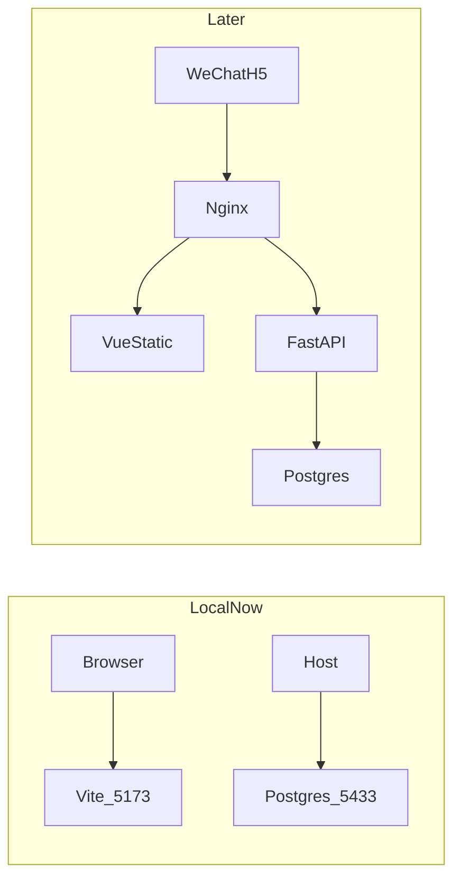

# 营地活动预约（activity-booking）

从营地公众号进入的轻量活动预约 H5。一套代码服务多个营地，最终部署到腾讯云 ECS。

## 技术栈

- 前端：Vue 3 + Vite + TypeScript + Vant 4
- 后端：FastAPI
- 数据库：PostgreSQL 16
- 本地与生产编排：Docker Compose
- 生产：Ubuntu 24.04 + Nginx（静态资源 + 反向代理）+ HTTPS + 多营地域名

## 仓库结构

```text
activity-booking/                # 本地开发总入口
├── frontend/                    # 前端（Vue 3 + Vite + TS + Vant）
│   ├── playground/              # Design System playground
│   └── src/
│       ├── assets/              # 静态资源
│       ├── data/                # mock 数据（联调前）
│       ├── components/          # 组件
│       ├── views/               # 页面视图
│       └── styles/              # Design tokens + Vant 主题 + reset
├── backend/                     # 后端（FastAPI）— 第 9 步再加入
├── compose.yaml                 # 当前仅 postgres；前后端服务后续加入
├── backup/                      # 数据备份目录（第 17 步再加脚本；dump 文件不进 Git）
├── .env.example                 # 复制为 .env 后填写
└── README.md
```

`backend/`、`backup/` 目前是占位。`frontend/playground/` 是样式系统预览页，不进入游客主路径。

## 架构

本地可同时跑 Vite 开发服务器与 PostgreSQL。后端、Nginx 按路线图逐步补上。



生产目标（第 14–16 步）：Nginx 托管前端静态资源并反代 FastAPI；Compose 运行 frontend + backend + postgres；多营地域名 + HTTPS。

## 开发计划

Compose 与 PostgreSQL 前置到 Vue 之前，先稳住本地基础设施。

1. [x] 创建本地入口
2. [x] Docker Compose
3. [x] PostgreSQL 加入 Compose
4. [x] Vue 3 + Vite + TypeScript + Vant
5. [x] UI Design System
6. [x] Playground
7. [ ] 手机 / 微信预览
8. [x] 游客端页面（活动列表主页；详情与预约未做）
9. [ ] FastAPI
10. [ ] Backend 加入 Compose
11. [ ] PostgreSQL 数据模型
12. [ ] 前后端联调
13. [ ] 多营地 URL
14. [ ] Nginx
15. [ ] 腾讯云 ECS
16. [ ] 生产 Compose 部署
17. [ ] 数据库自动备份

**当前状态：** 第 1–6、8 步已完成（入口 + PostgreSQL + Vue/Vant + token + Playground + 活动列表主页）。详情页、预约表单、后端尚未开始。

**下一步：** 活动详情页，或手机 / 微信预览。

## 本地启动

### 依赖

- Docker Desktop（或兼容的 Docker Engine + Compose v2）
- Node.js 22+（前端开发服务器）

### PostgreSQL

```bash
cp .env.example .env
```

在 `.env` 中填写 `POSTGRES_PASSWORD`（必填，未填写则 Compose 会拒绝启动）。

```bash
docker compose up -d
docker compose ps
docker compose exec postgres pg_isready -U booking -d activity_booking
```

`pg_isready` 应输出 `accepting connections`。连接串（密码换成 `.env` 里的值）：

```text
postgresql://booking:<password>@127.0.0.1:5433/activity_booking
```

数据库名、用户、宿主机端口均可在 `.env` 中修改：`POSTGRES_DB`、`POSTGRES_USER`、`POSTGRES_HOST_PORT`。

若拉取 `postgres:16-alpine` 超时，在 `.env` 中取消注释：

```bash
POSTGRES_IMAGE=docker.1ms.run/library/postgres:16-alpine
```

然后重新 `docker compose up -d`。

停止：`docker compose down`。数据在 named volume `postgres_data` 中，普通 `down` 不会删除。需要清空数据库时用 `docker compose down -v`（不可恢复）。

### 前端

```bash
cd frontend
npm install
npm run dev
```

浏览器打开终端里打印的地址（默认 `http://127.0.0.1:5173`）。Vite 已开启 `host: true`，同一局域网的手机也可访问打印出的 Network 地址。首页为营地信息 + 活动卡片列表（mock 数据）；点卡片会 Toast 占位，详情页尚未接入。

样式系统 Playground：`http://127.0.0.1:5173/playground/`（色板、字体、间距、圆角、Vant 示例）。

`4173` 是 `npm run preview` 的生产构建预览端口，不是开发服务。日常请用 `npm run dev`（5173）。

生产构建：

```bash
cd frontend
npm run build
```

## 环境变量

| 变量 | 说明 | 默认 |
| --- | --- | --- |
| `POSTGRES_DB` | 数据库名 | `activity_booking` |
| `POSTGRES_USER` | 用户名 | `booking` |
| `POSTGRES_PASSWORD` | 密码（必填） | 无 |
| `POSTGRES_HOST_PORT` | 宿主机端口 | `5433` |
| `TZ` | 时区 | `Asia/Shanghai` |
| `POSTGRES_IMAGE` | 镜像（可选换源） | `postgres:16-alpine` |

不要把 `.env` 提交进 Git。备份 dump（`backup/*.sql`、`backup/*.dump`）同样被忽略。

## 样式系统

默认主题是新中式户外森系，定义在 `frontend/src/styles/tokens.css`，并经 `vant-theme.css` 接到 Vant。页面和业务样式使用语义变量（`--color-pine`、`--space-md`），不要写死灰蓝色。多营地换肤（第 13 步）覆盖这些变量即可。

本地预览：`cd frontend && npm run dev`，打开 `/playground/`。
