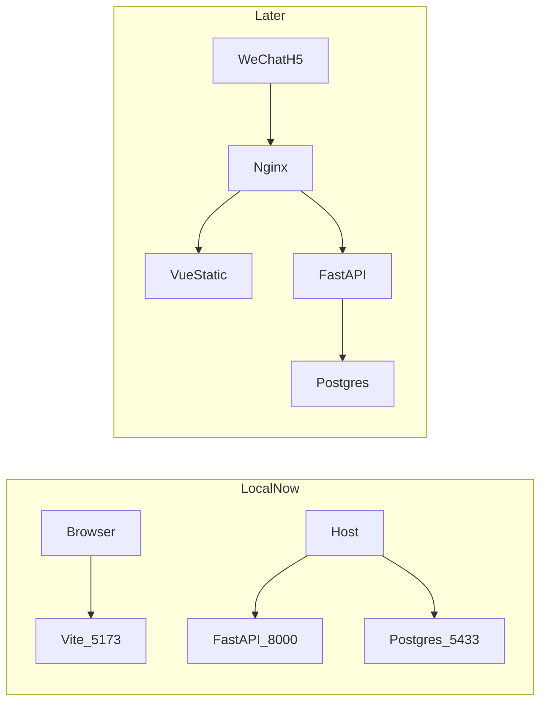
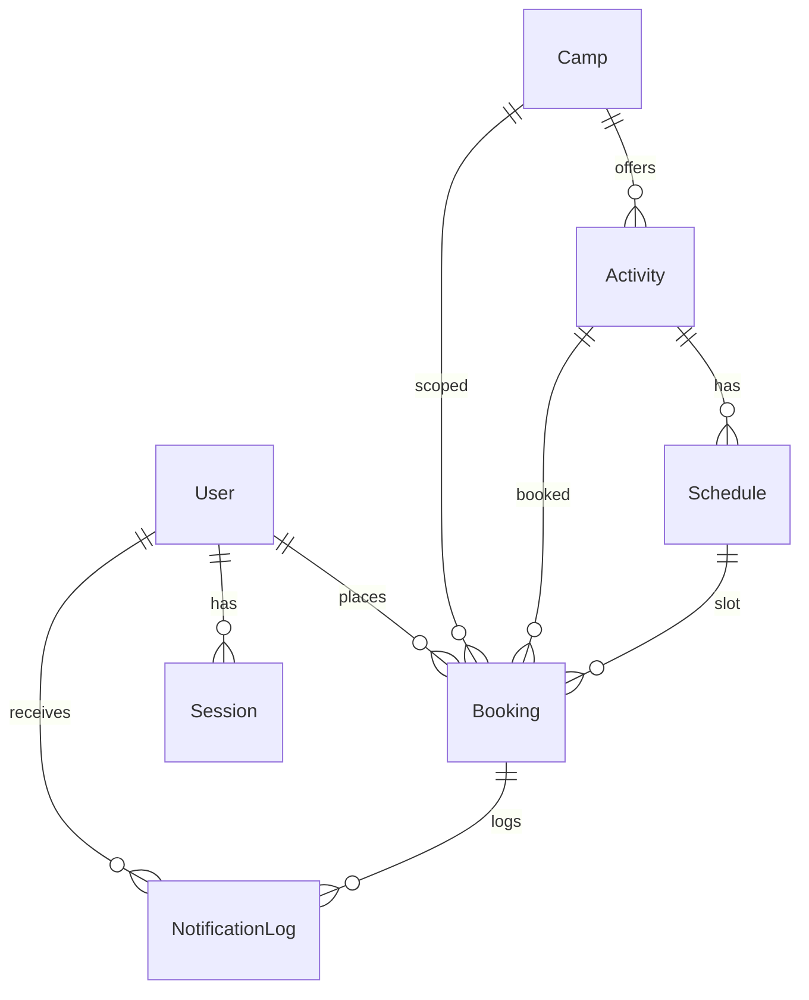

# 营地活动预约（activity-booking）

从营地公众号进入的轻量活动预约 H5。一套代码服务多个营地，最终部署到腾讯云 ECS。

## 技术栈

- 前端：Vue 3 + Vite + TypeScript + Vant 4
- 后端：FastAPI（Python 3.12）
- 数据库：PostgreSQL 16
- 本地与生产编排：Docker Compose
- 生产：Ubuntu 24.04 + Nginx（静态资源 + 反向代理）+ HTTPS + 多营地域名

## 仓库结构

```text
activity-booking/                # 本地开发总入口
├── frontend/                    # 前端（Vue 3 + Vite + TS + Vant）
│   ├── playground/              # Design System playground
│   └── src/
│       ├── assets/              # 静态资源
│       ├── data/                # mock 数据（联调前）
│       ├── components/          # 组件
│       ├── views/               # 页面视图
│       └── styles/              # Design tokens + Vant 主题 + reset
├── backend/                     # 后端（FastAPI）
│   ├── app/
│   │   ├── main.py              # 创建 App、注册 router / middleware / exception / lifespan
│   │   ├── api/routers/         # HTTP：校验、调 Service、状态码
│   │   ├── schemas/             # Pydantic 入出参
│   │   ├── services/            # 业务编排
│   │   ├── repositories/        # 数据访问
│   │   ├── models/              # SQLAlchemy 表结构
│   │   ├── integrations/wechat/ # 微信 OAuth / 通知 Client
│   │   └── core/                # 配置、异常、中间件、引擎
│   ├── alembic/                 # 迁移脚本
│   ├── alembic.ini
│   ├── requirements.txt
│   ├── scripts/                 # 本地种子数据（不走 Alembic）
│   └── 后端/                    # Python 3.12 虚拟环境（不进 Git）
├── compose.yaml                 # 当前仅 postgres；前后端服务后续加入
├── backup/                      # 数据备份目录（第 22 步再加脚本；dump 文件不进 Git）
├── .env.example                 # 复制为 .env 后填写
└── README.md
```

`backup/` 目前是占位。`frontend/playground/` 是样式系统预览页，不进入游客主路径。虚拟环境目录 `backend/后端/` 不进 Git。第 12 步已接微信登录骨架（凭据未配时 mock）。第 13 步已提供营地/活动/排期只读 API（需先 seed）。

## 架构

本地可同时跑 Vite 开发服务器、FastAPI 与 PostgreSQL。Nginx 按路线图逐步补上。



生产目标（第 19–21 步）：Nginx 托管前端静态资源并反代 FastAPI；Compose 运行 frontend + backend + postgres；多营地域名 + HTTPS。

## 开发计划

Compose 与 PostgreSQL 前置到 Vue 之前，先稳住本地基础设施。

1. [x] 创建本地入口
2. [x] Docker Compose
3. [x] PostgreSQL 加入 Compose
4. [x] Vue 3 + Vite + TypeScript + Vant
5. [x] UI Design System
6. [x] Playground
7. [ ] 手机 / 微信预览
8. [x] 游客端页面（列表 + 详情 + 预约表单 + 我的预约 + 营地介绍）
9. [x] FastAPI 骨架（`/health` + Python 3.12 虚拟环境）
10. [x] 后端分层骨架（目录 + 本架构说明；无业务实现、无建表）
11. [x] SQLAlchemy Model + Alembic 首迁（禁止在 route 里 `CREATE TABLE`）
12. [x] 微信 `snsapi_base` + Session Cookie
13. [x] 营地 / 活动 / 排期只读 API
14. [x] 预约写入与排期库存
15. [ ] 微信通知 Integration
16. [ ] 前端去掉 localStorage，前后端联调
17. [ ] Backend 加入 Compose
18. [ ] 多营地 URL
19. [ ] Nginx
20. [ ] 腾讯云 ECS
21. [ ] 生产 Compose 部署
22. [ ] 数据库自动备份

**当前状态：** 第 1–6、8–14 步已完成。游客端预约仍写在浏览器 localStorage。七张业务表已由 Alembic 迁入 Postgres。FastAPI 对外有 `/health`、Auth（未配微信凭据时走 mock）、营地/活动/排期只读 API 与预约写入（须登录，库存按人数扣减）。未进 Compose、未改前端调用。

**下一步：** 第 15 步微信通知 Integration（可先不发真模板）。

## 后端架构

禁止把数据库操作、业务逻辑、第三方 API 全部写进 FastAPI route 或 `main.py`。`main.py` 只负责：创建 App、注册 Router、注册 Middleware、注册 Exception Handler、生命周期初始化。

### 分层

| 层 | 路径 | 做 | 不做 |
| --- | --- | --- | --- |
| Router | `app/api/routers/` | HTTP、参数校验、调用 Service、返回 Response 与状态码 | SQL、库存事务、微信 HTTP |
| Schema | `app/schemas/` | Pydantic Request / Response / Query / Path | 查库 |
| Service | `app/services/` | 预约 / 用户 / 活动 / 排期 / 库存 / 状态机 / 登录编排 / 通知编排 | 直接调微信 HTTP、拼 SQL |
| Repository | `app/repositories/` | CRUD、条件检索 | HTTP、微信、业务规则 |
| Model | `app/models/` | SQLAlchemy 表结构 | 接口形状 |
| Integration | `app/integrations/wechat/` | 授权 URL、code → openid、模板通知 Client | 创建 User、写 Booking |
| Core | `app/core/` | 配置、异常、中间件挂载 | 业务 |

登录编排：`AuthRouter` → `AuthService` → `WechatOAuthClient` + `UserService` + `SessionService`。`BookingService` 不 import 微信 Client。

数据库结构用 SQLAlchemy Model + Alembic Migration 管理。任何结构变化必须产生 migration。禁止在生产库手改表，也禁止在 route 里 `CREATE TABLE`。

### ER

游客端现状：营地介绍 + 活动列表/详情（日期 + 时段库存）+ 预约表单（姓名、成人/儿童、手机、备注、合计价）+ 状态 `pending | contacted | expired`。微信静默授权只证明身份；姓名和手机以**当次预约快照**为准。



与前端对照：

| 实体 | 建议字段 | 前端对照 |
| --- | --- | --- |
| User | `id`，`openid`（唯一、仅后端），`unionid`（可空），`name`/`phone`（资料、可空），时间戳 | 业务表只外键 `user_id`。`snsapi_base` 换票**不含 unionid**（官方文档：仅 `snsapi_userinfo` 返回） |
| Camp | `id`，`name`，`slug`，`description`，`status`，时间戳 | location / story / 设施 / 套票 / 须知标为 v1.1，不挡预约主链 |
| Activity | `id`，`camp_id`，`name`，`description`，`cover`，`duration`，`status`，以及 `price` / `child_price` / `notice` | 图集、标签、详情段落可后续拆表 |
| Schedule | `id`，`activity_id`，`start_time`，`end_time`，`capacity`，`booked_count`，`status` | 对应「某日 + 某时段」；库存以排期行为准 |
| Booking | `id`，`user_id`，`camp_id`，`activity_id`，`schedule_id`，`contact_name`，`contact_phone`（快照必填），`adult_count` / `child_count`，`remark`，`total_price`（下单快照），`status`，时间戳 | 对齐表单；不要只留一个 `participant_count`；不要只依赖 User 的姓名手机 |
| NotificationLog | `id`，`user_id`，`booking_id`，`type`（成功/提醒/取消），`status`，`sent_at`，`error_message` | 第 15 步 |
| Session | `id`（随机 session id），`user_id`，`expires_at` | v1 存 PostgreSQL，不引入 Redis；Cookie 只带 session id |

套票 / 设施不进 v1 预约约束。

### 微信网页授权（snsapi_base）

依据 [微信网页授权](https://developers.weixin.qq.com/doc/service/guide/h5/auth.html)。适用**已认证服务号**。须配置网页授权域名（不含协议、全域名精确匹配）。`redirect_uri` 建议 https。授权链接参数顺序被强校验，必须以 `#wechat_redirect` 结尾。

第一版 `scope=snsapi_base`：静默、不弹窗、只能拿到 openid；此 scope 下换票后不必再调 userinfo。姓名/手机继续走预约表单快照。

```text
H5 → GET /api/auth/wechat/start
  → 302 open.weixin.qq.com/connect/oauth2/authorize
     (appid, redirect_uri, response_type=code, scope=snsapi_base, state, #wechat_redirect)
  → 微信回 redirect_uri/?code=&state=   （code 一次性，约 5 分钟）
  → GET /api/auth/wechat/callback
  → 校验 state（防 CSRF）
  → WechatOAuthClient：服务端 appid+secret+code
     GET api.weixin.qq.com/sns/oauth2/access_token
  → UserService 按 openid 查/建 User
  → SessionService 随机 session id，HttpOnly Cookie（生产 Secure）
  → 302 回 H5
```

安全：

- AppSecret、网页授权 access_token、服务号 access_token **只存在后端**，不进 Vue。
- OpenID 不当前端登录 Token，不进入业务 JSON。
- Session 使用随机不可预测的 Session ID，经 HttpOnly Cookie 下发。
- 必须校验 OAuth `state`。
- 若换票返回 `is_snapshotuser=1`（快照页虚拟号），拒绝当作正式用户。
- Secret 不进 Git。

**Mock 与真授权：** `WECHAT_APP_ID` 与 `WECHAT_APP_SECRET` **都非空** 时走真 `snsapi_base`；任一为空则走 mock（不请求微信）。Mock 下 `GET /api/auth/wechat/start` 会签发 `state` 并转到本服务 `/api/auth/wechat/callback?code=mock&state=...`，用固定 openid `mock-local-openid` 查/建 User、写 `sessions`、Set-Cookie 后 302 到 `H5_ORIGIN`。补齐 `.env` 中的 AppID、AppSecret、`WECHAT_OAUTH_REDIRECT_URI`（及 `WECHAT_OAUTH_STATE_SECRET`）后无需改代码即可真授权。网页授权 access_token 不落库、不回传前端；`/api/auth/me` 只返回 `id` 与 `logged_in`，不含 openid。未登录时 `/me` 返回 `{ "id": null, "logged_in": false }`（200，不强制 401）。

### API 规划

Auth（已实现）：

- `GET /api/auth/wechat/start`
- `GET /api/auth/wechat/callback`
- `POST /api/auth/logout`
- `GET /api/auth/me`（user id / 是否登录，**不含 openid**）

目录只读（已实现，游客无需登录；未 seed 时营地 404）：

- `GET /api/camps/:slug` 营地介绍（仅 `published`）
- `GET /api/camps/:slug/activities` 列表（活动 `status` 由排期推导 `open` | `full`）
- `GET /api/activities/:id` 详情 + 排期库存（含 `remaining`）

预约（已实现，须有效 Session Cookie；未登录 401。合计价以后端为准；`adult_count + child_count` 占库存。开始前 24 小时内不可取消）：

- `POST /api/bookings` 创建（校验余位、写快照、占库存）
- `GET /api/bookings`、`GET /api/bookings/:id` 我的预约
- `POST /api/bookings/:id/cancel` pending → expired（24 小时规则在 Service）

`/health` 无鉴权。业务 API 前缀 `/api`。

## 本地启动

### 依赖

- Docker Desktop（或兼容的 Docker Engine + Compose v2）
- Node.js 22+（前端开发服务器）
- Python 3.12（后端虚拟环境；本机默认 `python3` 若不是 3.12，请用 `python3.12`）

### PostgreSQL

```bash
cp .env.example .env
```

在 `.env` 中填写 `POSTGRES_PASSWORD`（必填，未填写则 Compose 会拒绝启动）。

```bash
docker compose up -d
docker compose ps
docker compose exec postgres pg_isready -U booking -d activity_booking
```

`pg_isready` 应输出 `accepting connections`。连接串（密码换成 `.env` 里的值）：

```text
postgresql://booking:<password>@127.0.0.1:5433/activity_booking
```

数据库名、用户、宿主机端口均可在 `.env` 中修改：`POSTGRES_DB`、`POSTGRES_USER`、`POSTGRES_HOST_PORT`。

若拉取 `postgres:16-alpine` 超时，在 `.env` 中取消注释：

```bash
POSTGRES_IMAGE=docker.1ms.run/library/postgres:16-alpine
```

然后重新 `docker compose up -d`。

停止：`docker compose down`。数据在 named volume `postgres_data` 中，普通 `down` 不会删除。需要清空数据库时用 `docker compose down -v`（不可恢复）。

### 后端

首次：

```bash
cd backend
python3.12 -m venv 后端
source 后端/bin/activate
python -c "import sys; print(sys.version)"   # 须为 3.12.x
pip install -U pip
pip install -r requirements.txt
```

迁移（Postgres 已 `docker compose up -d`，且 `.env` 中有密码）：

```bash
cd backend
source 后端/bin/activate
alembic upgrade head
```

结构变化必须再生成 migration（`alembic revision --autogenerate -m "..."`），禁止在 route 或 `main.py` 里 `CREATE TABLE` / `create_all`。

启动：

```bash
cd backend
source 后端/bin/activate
uvicorn app.main:app --reload --host 0.0.0.0 --port 8000
```

健康检查：`curl -s http://127.0.0.1:8000/health` 应返回 `{"status":"ok"}`。OpenAPI 文档：`http://127.0.0.1:8000/docs`。

未填写微信 AppID/Secret 时，可用 mock 登录：`GET /api/auth/wechat/start` 会 302 到本服务 callback，最终 Set-Cookie 并跳到 `H5_ORIGIN`。`GET /api/auth/me` 带 Cookie 应返回 `logged_in: true` 且 JSON 无 `openid`。前端尚未改调这些接口。

目录只读 API 依赖种子数据（表默认是空的，未 seed 时 `GET /api/camps/luhe` 为 404）：

```bash
cd backend
source 后端/bin/activate
python scripts/seed_catalog.py
```

会写入已发布营地 `luhe`（麓禾村）和一条游客不可见的 `hidden-draft`。可重复执行。若该活动已有预约，seed **不会**删除排期，以免破坏库存。

预约写入须先 mock 登录（带 Cookie 调 `POST /api/bookings`）。前端仍写 localStorage，第 16 步再改调 API。不进 Compose。

### 前端

```bash
cd frontend
npm install
npm run dev
```

浏览器打开终端里打印的地址（默认 `http://127.0.0.1:5173`）。Vite 已开启 `host: true`，同一局域网的手机也可访问打印出的 Network 地址。首页为营地海报 + 活动卡片；点海报进营地介绍，点卡片进详情（轮播、分时段、价格）。「立即预约」打开表单，提交后写入本机 localStorage，可在「我的预约」查看或取消。

样式系统 Playground：`http://127.0.0.1:5173/playground/`（色板、字体、间距、圆角、Vant 示例）。

`4173` 是 `npm run preview` 的生产构建预览端口，不是开发服务。日常请用 `npm run dev`（5173）。

生产构建：

```bash
cd frontend
npm run build
```

## 环境变量

| 变量 | 说明 | 默认 |
| --- | --- | --- |
| `POSTGRES_DB` | 数据库名 | `activity_booking` |
| `POSTGRES_USER` | 用户名 | `booking` |
| `POSTGRES_PASSWORD` | 密码（必填） | 无 |
| `POSTGRES_HOST_PORT` | 宿主机端口 | `5433` |
| `TZ` | 时区 | `Asia/Shanghai` |
| `POSTGRES_IMAGE` | 镜像（可选换源） | `postgres:16-alpine` |
| `DATABASE_URL` | FastAPI / Alembic 连接串 | 可由 Postgres 变量拼出 |
| `WECHAT_APP_ID` | 服务号 AppID（与 Secret 都填才走真 OAuth） | 空（mock） |
| `WECHAT_APP_SECRET` | 服务号 AppSecret（不进 Git） | 空（mock） |
| `WECHAT_OAUTH_REDIRECT_URI` | 网页授权回调 URL（真 OAuth 必填） | 空 |
| `WECHAT_OAUTH_STATE_SECRET` | 签发 OAuth `state` 的密钥 | 空时仅 mock，用本地 dev 密钥 |
| `SESSION_COOKIE_NAME` | Session Cookie 名 | `ab_session` |
| `SESSION_COOKIE_SECURE` | Cookie `Secure`（本地 http 为 false） | `false` |
| `SESSION_TTL_SECONDS` | Session 有效期（秒） | `604800`（7 天） |
| `H5_ORIGIN` | 登录成功 302 目标；CORS 允许源 | `http://127.0.0.1:5173` |

不要把 `.env` 提交进 Git。备份 dump（`backup/*.sql`、`backup/*.dump`）同样被忽略。

## 样式系统

默认主题是新中式户外森系，定义在 `frontend/src/styles/tokens.css`，并经 `vant-theme.css` 接到 Vant。页面和业务样式使用语义变量（`--color-pine`、`--space-md`），不要写死灰蓝色。多营地换肤（第 18 步）覆盖这些变量即可。

本地预览：`cd frontend && npm run dev`，打开 `/playground/`。
